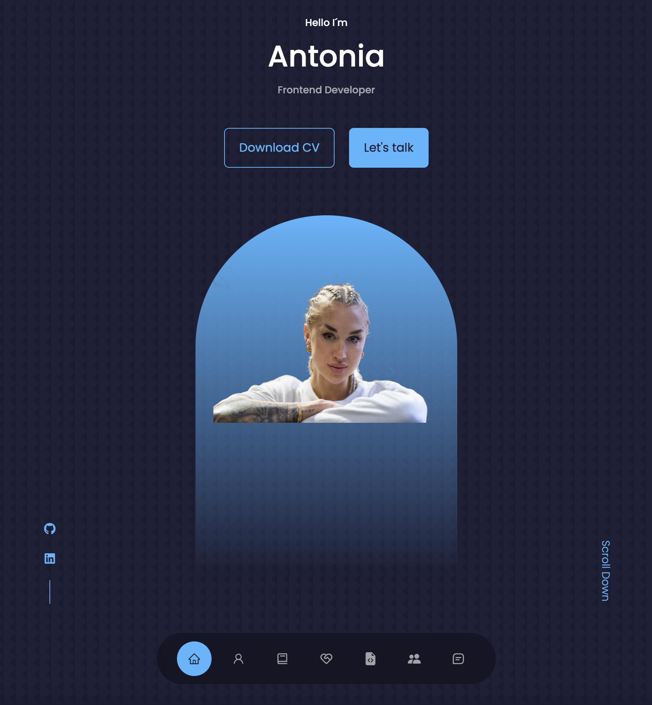

# About me

### LINK TO LIVE DEMO: http://antoniaportfolio.com/  

    I am a Junior developer and long for someone who dares to invest in
            us juniors! Mainly have knowledge in front-end development such as
            JavaScript, css, APIs, frameworks such as React, Angular, Vue. Also
            have an eye for UX and design. In backend I have knowledge mainly in
            node js, mySql, Sql, mongoDB. I understand how to build single-page
            applications. Knowledge of device testing. Can communicate and write
            fluently in Swedish and English. I am flexible and thrive in Agile
            projects.

 

## Table of contents

- [General info](#general-info)
- [Technologies](#technologies)
- [Setup](#setup)

## General info

FeadMeApp is a degree project for my education as a Frontend Developer at the Media in this code you will find my portfolio and my CV as the frontend developet.
The project is deployed and is live on Hostinger.

## Technologies

Project is created with:

- react version: "^17.0.2",

## Setup

To run this project, install it locally using npm install
